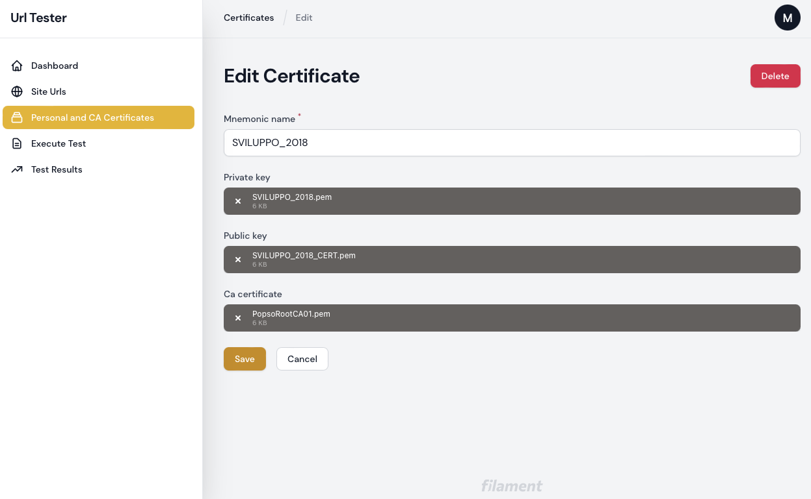
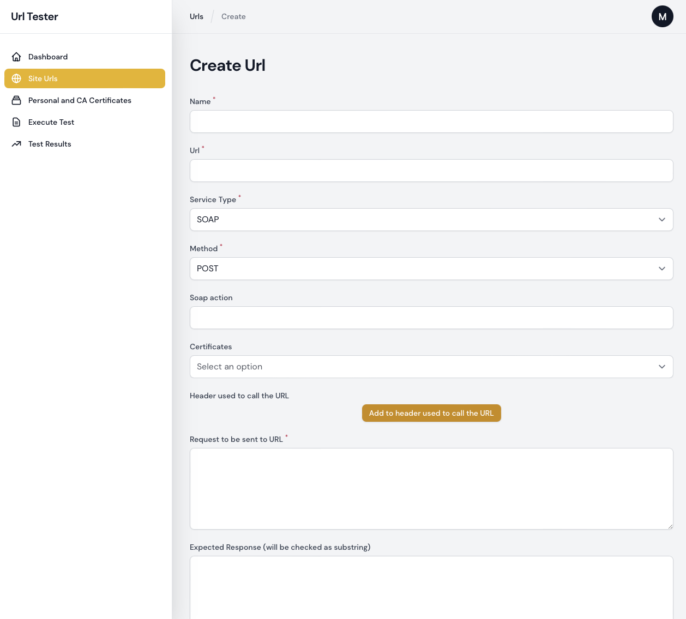

# URL Tester

This Laravel/Filament project is written for people who want to test Soap and Rest services protected with x509 Certificates.
It can be used to:
- test on demand single or multiple urls
- execute the tests via console
- view the results (success and failures)

It uses the cURL functions in PHP.

## Requirements

- PHP >= 8.1
- cURL Extension
- Database (MySQL, PostgreSQL)

## Installation

- clone the repository
- create database
- create a .env file 
- run migrations: `php artisan migrate:fresh`
- create a user with `php artisan make:filament-user`
- update the user setting is_admin field to true
- execute `composer install`
- execute `npm install`
- execute `npm run build`
- modify the Makefile according to your needs

## Usage

Simply login into admin area. 

Add every x509 certificate you need:



Then define every endpoint you need to test:



## Command Line

If you want to execute all the tests inside the database (url table) simply execute the artisan command

```
php artisan urltester:execute
```

## Test

```
./vendor/bin/pest
```

## ToDos

- add cron jobs

## Credits

- [Laravel](https://laravel.com/)
- [FilamentPHP](https://filamentphp.com)

## Contributing

Thank you for considering contributing to URL Tester! Please contact me via GitHub.

## License

This project is open-sourced software licensed under the [MIT license](https://opensource.org/licenses/MIT).
